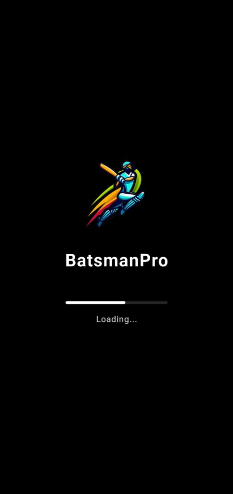

# Batsman Pro - AI Cricket Analytics



Batsman Pro is an AI-powered cricket analytics app that automatically analyzes batting videos to generate highlights, classify shots, and deliver actionable performance insights for players and coaches.

## 🚀 Features

- **AI Shot Detection**: Automatically detects bat-ball contact and classifies cricket shots (e.g., Cover Drive, Pull Shot).
- **Auto-Highlights**: Condenses long match footage into key moments.
- **Performance Analytics**: Provides detailed metrics on batting technique.
- **Secure Processing**: Enterprise-grade data security.

## 🛠️ Technology Stack

- **Frontend**: React, Vite, Framer Motion
- **Backend**: Flask, Firebase
- **AI/ML**: Python, PyTorch, YOLO
- **Mobile App**: Flutter

## 📦 Installation & Setup

1. **Clone the repository**
   ```bash
   git clone https://github.com/yourusername/batsman-pro-web.git
   cd batsman-pro-web
   ```

2. **Install dependencies**
   ```bash
   npm install
   ```

3. **Run the development server**
   ```bash
   npm run dev
   ```

4. **Build for production**
   ```bash
   npm run build
   ```

## 📱 Mobile App

The companion mobile application is built with Flutter and is available for Android.

## 📄 License

This project is licensed under the MIT License - see the [LICENSE](LICENSE) file for details.

## 📧 Contact

For support or inquiries, please email us at [support@batsmanpro.com](mailto:support@batsmanpro.com).
